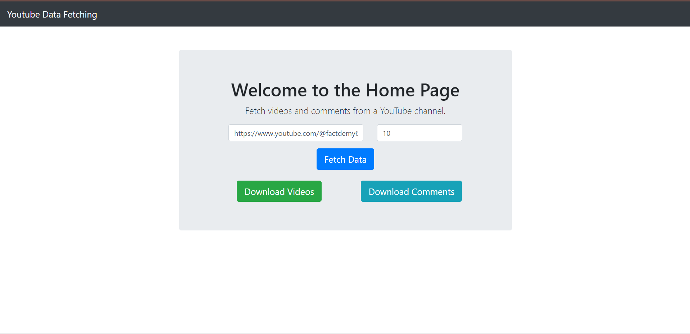

# YouTube Channel Video and Comments Data Fetcher

## Application Screenshot

Here is a screenshot of the application:



## Overview

The **YouTube Channel Video and Comments Data Fetcher** is a Python application designed to fetch and download data from a specified YouTube channel. It allows users to retrieve basic information about videos and the latest comments (with replies) from the channel, storing the results in an Excel file with separate sheets for video data and comments data.

## Features

- Fetch video details including title, description, and upload date.
- Retrieve the latest comments (and replies) for each video.
- Download data in an Excel file format.
- User-friendly web interface for inputting YouTube channel URLs and comment count.

## Prerequisites

- Python 3.x
- Django
- Requests library
- OpenPyXL or Pandas for Excel file handling

## Installation

1. Clone the repository:
   ```bash
   git clone https://github.com/pranjal2523/youtube-data-fetcher.git
   cd youtube-data-fetcher
   ```
2. Create a virtual environment (optional but recommended):
    ```
    python -m venv env
    source env/bin/activate  # On Windows use `env\Scripts\activate`
    ```
3. Install the required packages
    ```
    pip install -r requirements.txt
    ```
4. Create a .env file in the root directory to store your environment variables (API keys, etc.).

5. Run the application:
    ```
    python manage.py makemigrations
    python manage.py migrate
    python manage.py runserver
    ```
## Usage
- Open your web browser and navigate to http://localhost:8000 (or your specified URL).
- Enter the YouTube channel URL in the input box.
- Specify the number of comments you want to retrieve (default is 100).
- Click on the Download Videos or Download Comments button to fetch and download the data.